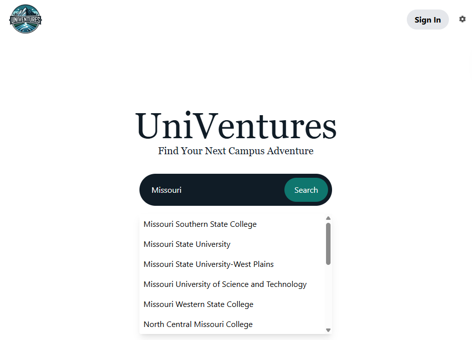
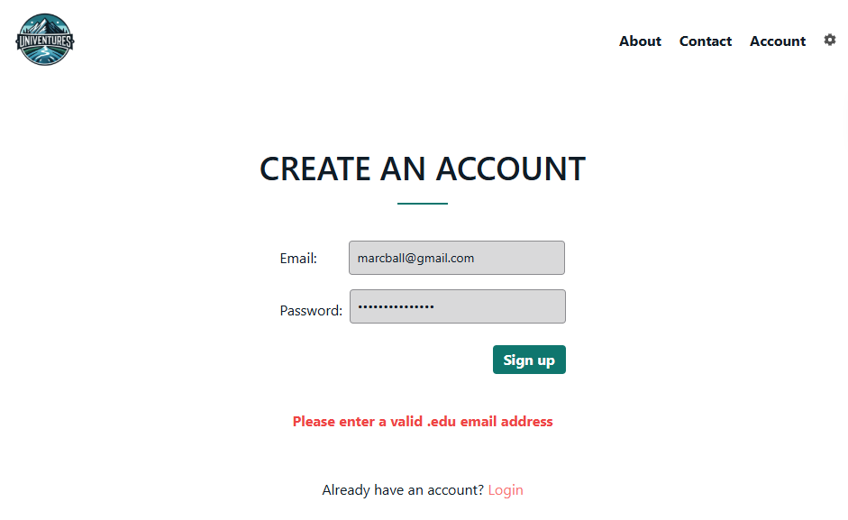
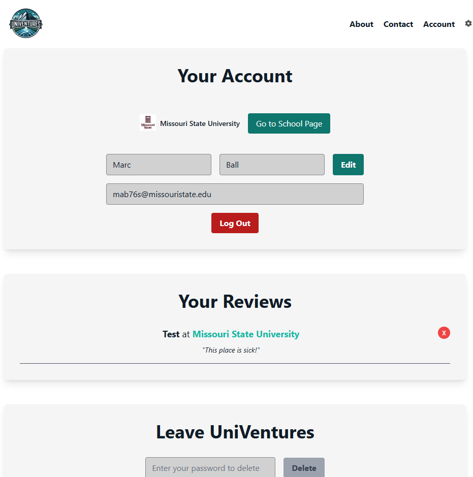
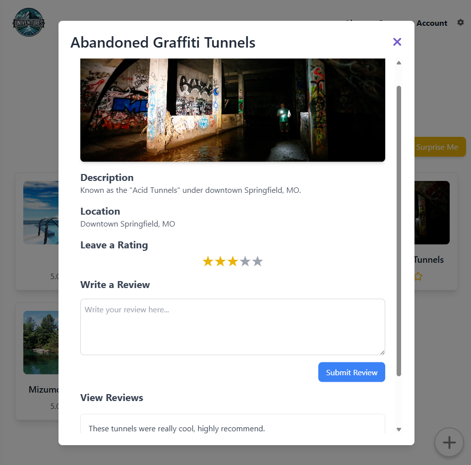
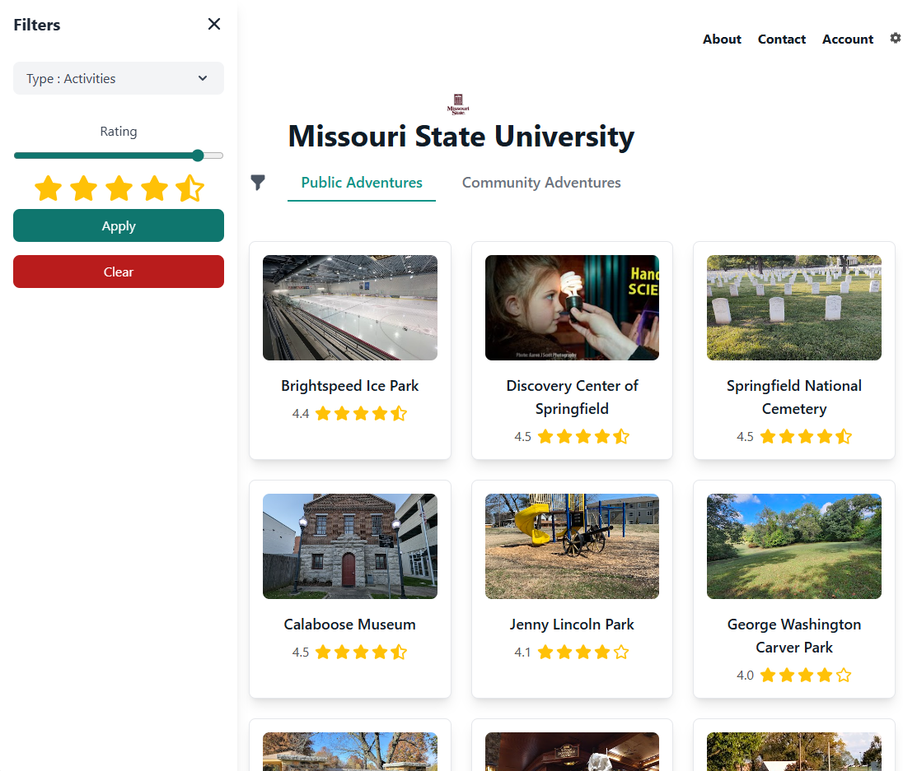

# UniVentures

**UniVentures** is a full-stack web application that helps college students discover and share local experiences tied to their university. By integrating real-time data from the Google Places API with community-submitted content, the platform allows users to explore what’s around campus, rate and review locations, and contribute their own adventures.

## Live Demo

Visit the deployed site: [UniVentures](https://https://univentures.vercel.app/)

## Features

- **University-Based Search**  
  Search any U.S. university by name. Campus information is automatically matched using OpenStreetMap and school domain data.

- **Public Adventures**  
  Discover real-world nearby locations using Google Places API, including restaurants, activities, stores, and more.

- **Community Adventures**  
  Users can submit custom adventures with a title, description, image, location, and category. All content is tied to a specific university.

- **Account System**  
  - Signup with `.edu` email (email verification required)  
  - Strong password enforcement  
  - Session-based authentication  
  - View and manage submitted reviews

- **Filtering and Ratings**  
  Filter adventures by type or minimum star rating. Submit 1–5 star ratings and text reviews for any location.

- **Contact Form**  
  Includes a contact page for user inquiries, routed to the UniVentures support email.

## Screenshots


### Homepage  
Search by university to begin exploring campus adventures.  


### Create an Account  
Sign up using your `.edu` email to join your university's community.  


### Account Dashboard  
View your personal information, school affiliation, and all reviews you've submitted.  


### Example Adventure  
A user-submitted community adventure titled **"Abandoned Graffiti Tunnels"**, featuring a custom photo, title, description, address, star rating input, and a full list of user reviews.  


### University Page  
View adventures and filters specific to your selected school. Toggle between public (Google Places) and community-submitted adventures with type and rating filters.


## Tech Stack

**Frontend**
- React
- Tailwind CSS

**Backend**
- Python (Flask)
- MySQL
- Flask-Mail
- Google Places API
- OpenStreetMap API (Nominatim)

## Database Overview

UniVentures uses two MySQL databases:

- `users`: stores user account credentials and metadata  
- `schools`: stores university listings, locations, ratings, and reviews

Each user is associated with a school via email domain. University geolocation data is retrieved using OpenStreetMap, and all adventures (public or submitted) are connected to a specific campus.

## Environment Variables

To run this project locally or in a development environment, create a `.env` file using the structure below.

```env
DB_HOST=localhost
DB_USER=root
DB_PASSWORD=your_mysql_password
DB_SCHOOLS=schools
DB_USERS=users

SECRET_KEY=your_flask_secret_key
SERIALIZER_SECRET=your_serializer_secret_key
ADMIN_SECRET_KEY=your_admin_key

MAIL_USERNAME=your_email@gmail.com
MAIL_PASSWORD=your_email_app_password

GOOGLE_API_KEY=your_google_maps_api_key


*To run this project locally or in deployment, the frontend expects:

REACT_APP_API_URL=https://your-backend-url.com*
```

## Hosting Notes

This project can be deployed using any combination of static frontend hosting (such as Vercel), a Python-compatible backend service (such as Railway), and a cloud-hosted MySQL provider. Before deployment, update all environment variables with production credentials.

## Project Info

This was a final project developed for a Missouri State Software Engineering course in collaboration with three other team members. Their names have been omitted here for anonymity. 

I have continued development on this project by extending its functionality and transitioning it from a local development environment to a live deployment using Vercel and Railway.

## License

This project is licensed under the [MIT License](LICENSE).
